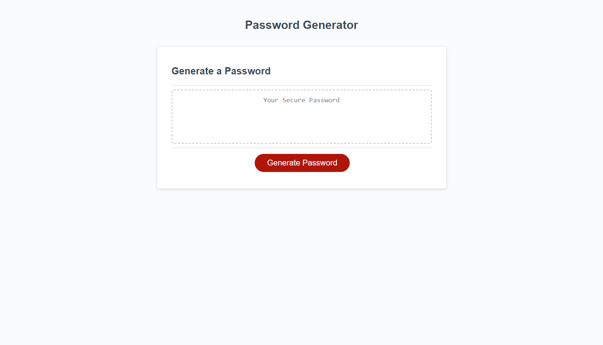

# password-generator

## Description

This project is a password generator webpage created from html/ css starter code along with some javascript coding. The purpose of this application is to create a random password base off of the user's input and selected criteria.

## Tasks Completed

- Created a basic outline of tasks using pseudocodes
- Defined the function generatePassword in reference to the given starter code
- Created a series of prompts which allows users to select criteria for their generated password
- Created an alert for when at least one of the criteria is not selected.
- Created "if" statements to concatenate the user's selections
- Created a "for loop" to generate random characters based off of the criteria input
- Allowed for the newly generated password to display written to the page

## Links

Deployed Website: 

GitHub Code Repository: 

## Installation

Deploy repository containing index.html, README.md, and script.js files to a web server.

## Usage

The deployed application can be viewed through a desktop web browser. It is also optimized for screen sizes smaller than 690px.

The following image shows the up to date appearance and functionality of the Password Generator webpage:

## Credits
- Instructional Staff at the University of Minnesota Coding Bootcamp
- MDN Web Docs

## License

MIT License

Copyright (c) 2023 Nainoa Dinson

Permission is hereby granted, free of charge, to any person obtaining a copy
of this software and associated documentation files (the "Software"), to deal
in the Software without restriction, including without limitation the rights
to use, copy, modify, merge, publish, distribute, sublicense, and/or sell
copies of the Software, and to permit persons to whom the Software is
furnished to do so, subject to the following conditions:

The above copyright notice and this permission notice shall be included in all
copies or substantial portions of the Software.

THE SOFTWARE IS PROVIDED "AS IS", WITHOUT WARRANTY OF ANY KIND, EXPRESS OR
IMPLIED, INCLUDING BUT NOT LIMITED TO THE WARRANTIES OF MERCHANTABILITY,
FITNESS FOR A PARTICULAR PURPOSE AND NONINFRINGEMENT. IN NO EVENT SHALL THE
AUTHORS OR COPYRIGHT HOLDERS BE LIABLE FOR ANY CLAIM, DAMAGES OR OTHER
LIABILITY, WHETHER IN AN ACTION OF CONTRACT, TORT OR OTHERWISE, ARISING FROM,
OUT OF OR IN CONNECTION WITH THE SOFTWARE OR THE USE OR OTHER DEALINGS IN THE
SOFTWARE.